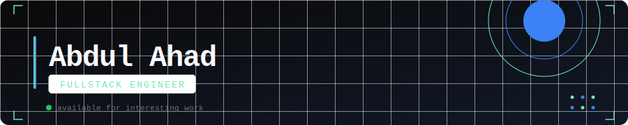
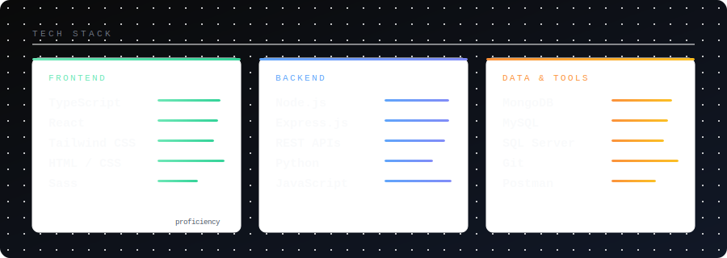

 

### `> about`
 
I've spent my career building, breaking, and fixing systems until they're resilient. Not just getting things to work — getting them to *keep* working under pressure, at scale, with a team that has to maintain it six months from now.
 
I don't chase trends. I build foundations. A well-modeled schema, a clean API contract, a component that doesn't leak state, these are the things that compound over time. Flashy tech choices don't impress me. Boring, solid code that ships and holds up does.
 
My stack sits in the PERN world — **PostgreSQL, Express, React, Node.js** with **TypeScript** throughout. I care about the seams between layers as much as the layers themselves: how the database schema shapes the API, how the API shapes the frontend, how all of it shapes the user's experience.
 
I write code for the person who reads it next, not just the machine that runs it.

&nbsp;

---

&nbsp;

&nbsp;

---

&nbsp;

<table>
  <tr>
    <td>
      
    </td>
    <td>
      
    </td>
  </tr>
</table>

&nbsp;

---

&nbsp;

📬 &nbsp; **ahadcodes.dev@gmail.com.com** &nbsp;·&nbsp; Open to interesting problems.
